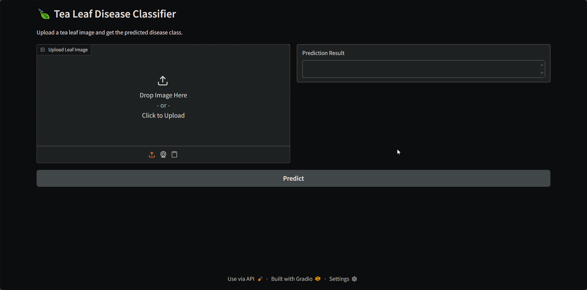

# LeafNet - Healyth vs unhealthy tea classifier
*A deep learning tool to classify tea leaves as healthy or unhealthy from images.*


---

## Table of Contents

- [Demo](#demo)
- [Features](#features)
- [Installation / Setup](#installation--setup)
- [Usage](#usage)
- [Configuration / Options](#configuration--options)
- [Contributing](#contributing)
- [License](#license)
- [Acknowledgements / Credits](#acknowledgements--credits)

---

## Demo


*Main interface for uploading and classifying tea leaf images.*


*Video walkthrough of the classification workflow.*

---

## Features

- Classifies tea leaf images as healthy or unhealthy using deep learning.
- Simple, interactive web-based UI for image upload and prediction.
- Modular codebase for easy extension and retraining.
- Fast inference for both single and batch image processing.

---

## Installation / Setup

```bash
# Create a virtual environment
python -m venv .venv

# Activate it
# On Linux/Mac:
source .venv/bin/activate
# On Windows:
.venv\Scripts\activate

# Install dependencies
pip install -r requirements.txt
```

---

## Usage

Run the application:

```bash
python app.py
```

This will launch the web interface in your browser.  
Upload an image of a tea leaf to get a health classification.

---

## Configuration / Options

- UI and model configuration can be adjusted in the source files.
- For advanced settings (e.g., model path, thresholds), edit the relevant Python files.

---

## Contributing

Contributions are welcome!
- Open issues for bugs or feature requests.
- Submit pull requests for improvements.
- Please follow standard Python code style and include tests where possible.

---

## License

This project is licensed under the MIT License. See the [LICENSE](./LICENSE) file for details.

---

## Acknowledgements / Credits

- Developed by Eslam Tarek.
- Thanks to the open-source community for libraries and inspiration.

